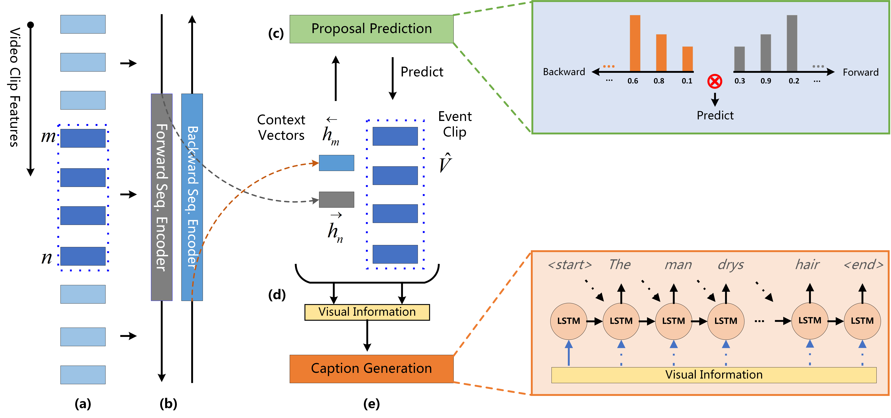

# DenseVideoCaptioning

Tensorflow Implementation of the Paper [Bidirectional Attentive Fusion with Context Gating for Dense Video Captioning](https://arxiv.org/abs/1804.00100) by Jingwen Wang *et al.* in *CVPR* 2018.

### Data Preparation

Please download annotation data and C3D features from the website [ActivityNet Captions](https://cs.stanford.edu/people/ranjaykrishna/densevid/). The ActivityNet C3D features with stride of 64 frames (used in my paper) can be found [here](https://drive.google.com/file/d/1D6-sDPEkOJX32h0-EclxpiEmiMkNGybo/view?usp=sharing).

Please follow the script dataset/ActivityNet_Captions/preprocess/anchors/get_anchors.py to obtain clustered anchors and their pos/neg weights (for handling imbalance class problem). I already put the generated files in dataset/ActivityNet_Captions/preprocess/anchors/.

Please follow the script dataset/ActivityNet_Captions/preprocess/build_vocab.py to build word dictionary and to build train/val/test encoded sentence data.

### Hyper Parameters

The configuration (from my experiments) is given in opt.py, including model setup, training options, and testing options.

### Training

Train dense-captioning model using the script train.py.

First pre-train the proposal module for around 5 epochs. Set train_proposal=True and train_caption=False. Then train the whole dense-captioning model by setting train_proposal=True and train_caption=True. To understand the proposal module, I refer you to the original [SST](http://openaccess.thecvf.com/content_cvpr_2017/papers/Buch_SST_Single-Stream_Temporal_CVPR_2017_paper.pdf) paper and also my tensorflow [implementation](https://github.com/JaywongWang/SST-Tensorflow) of SST.

### Prediction

Follow the script test.py to make proposal predictions and to evaluate the predictions.

### Evaluation

Please note that the official evaluation metric has been [updated](https://github.com/ranjaykrishna/densevid_eval/commit/bbbd49d31a038acf2642f7ae158bb6b9da6937fc) (Line 194). In the paper, old metric is reported (but still, you can compare results from different methods, all CVPR-2018 papers report old metric).

### Results

The predicted results for val/test set can be found [here](https://drive.google.com/drive/folders/1KZfzoTV3qqtnzALwZgd5IU5BRkj69SZ8?usp=sharing).

### Dependencies

tensorflow==1.0.1

python==2.7.5

Other versions may also work.

**Update:** 
1. I corrected some naming errors and simplified the proposal loss using tensorflow built-in function.
2. I uploaded C3D features with stride of 64 frames (used in my paper). You can find it [here](https://drive.google.com/file/d/1D6-sDPEkOJX32h0-EclxpiEmiMkNGybo/view?usp=sharing).
3. I uploaded val/test results of both without joint ranking and with joint ranking.
4. I uploaded video_fps.json and updated test.py.
5. Due to large file constraint, you may need to download data/paraphrase-en.gz [here](https://github.com/tylin/coco-caption/tree/3f0fe9b819c0ea881a56441e4de1146924a394eb/pycocoevalcap/meteor/data) and put it in densevid_eval-master/coco-caption/pycocoevalcap/meteor/data/.
6. I correct multi-rnn mistake caused by get_rnn_cell() function (see model.py).
